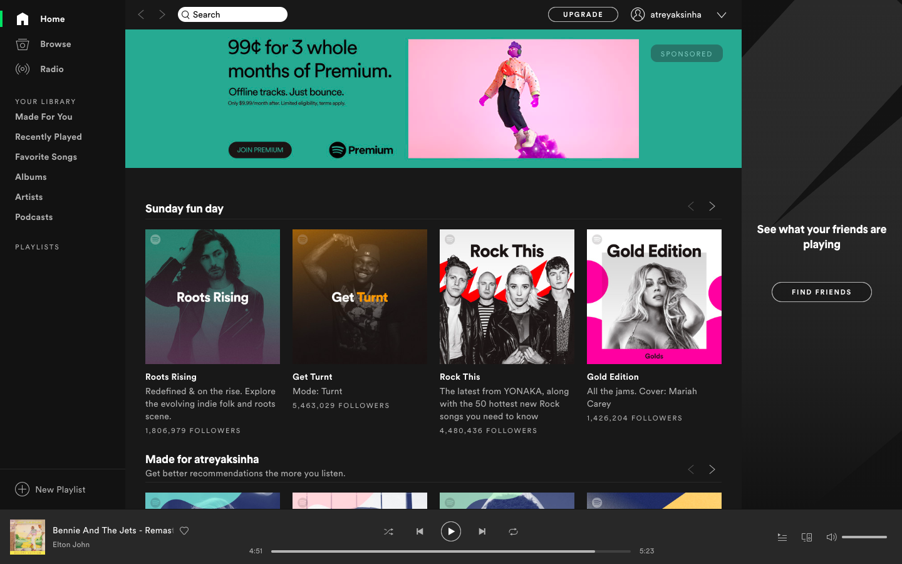

# Spotify Top 50 Song Explorer

This project allows for a user to explore various audio features of songs as well as look at how these audio features are correlated to how well a song does (as rated by how high the song is on the top 50s playlist.)

You can find the shiny app [here](https://pranay99.shinyapps.io/info201/)

The audio factors that are explored are:
##### Danceability
- describes how suitable a track is for dancing based on a combination of musical elements.
- Includes tempo, rhythm stability, beat strength, and overall regularity.
- 0.0 is the least danceable, and 1.0 is the most danceable.

##### Valence
- A measure from 0.0 to 1.0 describing the positivity conveyed by a track.
- Tracks with high valence sound more positive (e.g. happy, cheerful, euphoric), while tracks with low valence sound more negative (e.g. sad, depressed, angry).

##### Energy
- A measure from 0.0 to 1.0 that represents the perception of intensity and activity.
- Typically, energetic tracks feel fast, loud, and noisy.

##### Acousticness
- A confidence measure from 0.0 to 1.0 of whether the track is acoustic.
- 1.0 represents high confidence the track is acoustic.

##### Speechiness
- Detects the presence of spoken words in a track.
- The more exclusively speech-like the recording (e.g. talk show, audio book, poetry), the closer to 1.0 the attribute value is.
